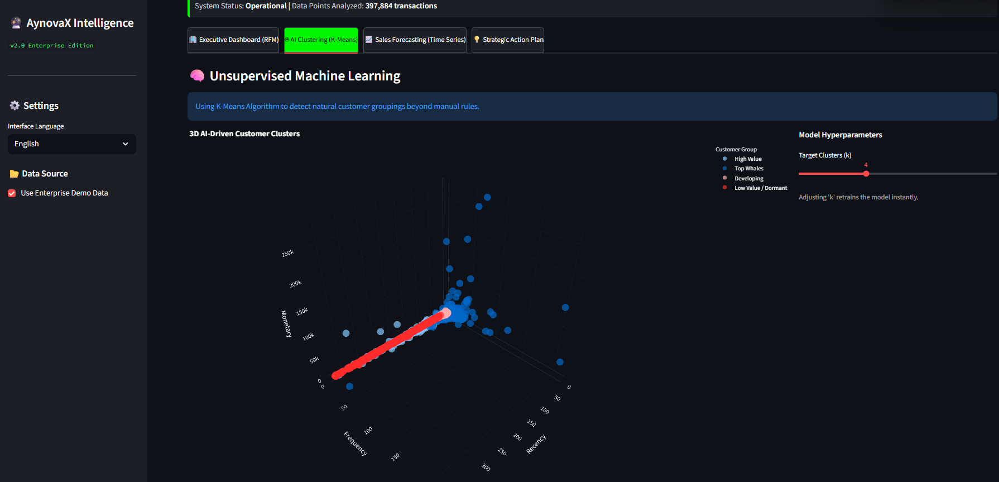
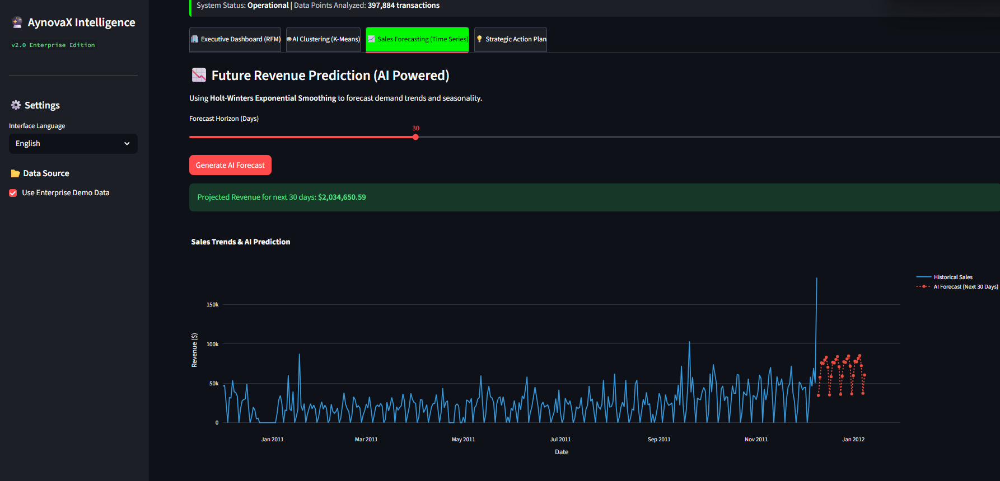

# 🔮 AynovaX Intelligence Suite | Enterprise Analytics

## 🌎 Overview / Resumen

**[EN]**
AynovaX Intelligence is a next-generation Data Analytics Platform designed to transform raw ERP transactional data into strategic business insights. Unlike traditional static dashboards, this application leverages **Unsupervised Machine Learning** and **Time-Series Forecasting** to not only describe *what happened* but to predict *what will happen*.

**[ES]**
AynovaX Intelligence es una plataforma de analítica avanzada diseñada para transformar datos transaccionales brutos en estrategias de negocio. A diferencia de los dashboards estáticos tradicionales, esta aplicación utiliza **Machine Learning No Supervisado** y **Predicción de Series Temporales** para no solo describir *qué pasó*, sino predecir *qué pasará*.

---

## 📸 Key Features & Visual Walkthrough

### 1. Executive RFM Dashboard
**[EN]** Real-time segmentation using the RFM model. It identifies high-value users ("Champions") versus those at risk of churning.
**[ES]** Segmentación en tiempo real usando el modelo RFM. Identifica usuarios de alto valor ("Campeones") contra aquellos en riesgo de fuga.

### 2. AI Clustering (Unsupervised Learning)
**[EN]** Using **K-Means Algorithm**, the system detects hidden patterns in customer behavior in a 3D space, grouping users by mathematical proximity rather than manual rules. 
**[ES]** Usando el **Algoritmo K-Means**, el sistema detecta patrones ocultos de comportamiento en un espacio 3D, agrupando usuarios por proximidad matemática en lugar de reglas manuales.

### 3. Sales Forecasting (Predictive AI)
**[EN]** A time-series forecasting engine powered by **Holt-Winters Exponential Smoothing**. It projects revenue for the next 30 days with confidence intervals.
**[ES]** Motor de predicción de series temporales impulsado por **Suavizado Exponencial (Holt-Winters)**. Proyecta los ingresos de los próximos 30 días con intervalos de confianza.

---

## 🛠️ Technology Stack / Tecnologías

| Component | Technology | Description |
| :--- | :--- | :--- |
| **Core** | Python 3.10+ | Backend Logic |
| **Frontend** | Streamlit | Reactive Web UI |
| **ETL** | Pandas, NumPy | Data Cleaning & Vectorization |
| **AI/ML** | Scikit-Learn | K-Means Clustering |
| **Forecasting** | Statsmodels | Exponential Smoothing |
| **Viz** | Plotly | Interactive 3D Charts |
